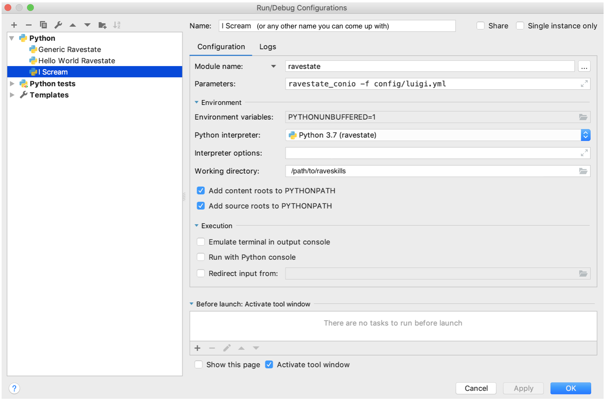
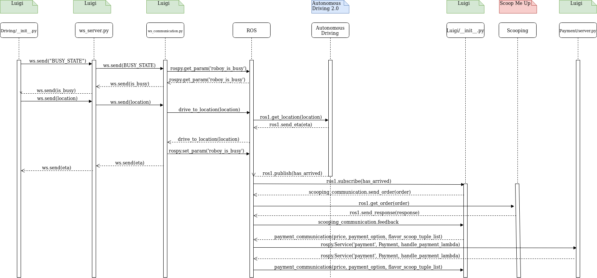
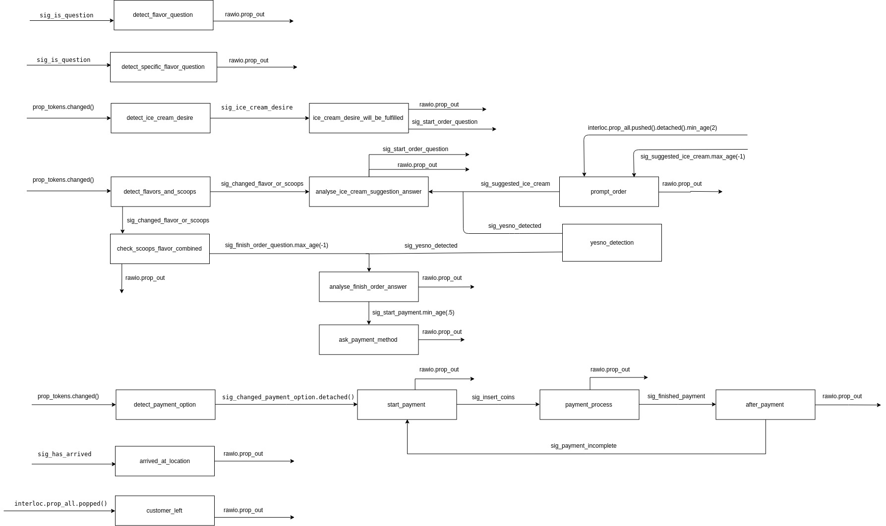

# Luigi 
Roboy raveskill to serve delicious ice cream! The dialogue will start with the ordering process, conduct a conversation while waiting for the scooping of the ice cream and conclude the ice cream selling by a payment dialogue.

## Setup
Follow the steps described in the raveskills [README.md](../../README.md) to set up and configure the environment. You don't need to setup [Scientio](https://github.com/roboy/scientio).

## Usage


### Starting the docker container
We assume that you have already built a Docker container as described in the [raveskills README.md](../../README.md). Now you can execute it using the commands: 
```bash
cd /path/to/raveskills
docker-compose up --detach raveskills
docker exec -ti raveskills bash -l
```
Depending on how your container is configured, you might need to also run the following command inside the container:
```bash
source ~/melodic_ws/devel/setup.sh
```

### Running the Luigi module using docker
Open 4 tabs in the `raveskills`-container as described above. In the first tab start roscore with
```bash
roscore
```
In the second tab execute
```bash
cd /raveskills/modules/luigi/ && python3 payment_server_mockup.py
```
In the third tab run
```bash
cd /raveskills/modules/luigi/ && python3 scooping_server_mockup.py
```
And finally in the fourth tab
```bash
cd /raveskills && python3 -m ravestate -f config/luigi.yml
```
Now you can start talking to the Luigi dialogue and start ordering delicious ice cream :)

### Running the Luigi module together with the Telegram bot
Follow the steps as described in the [Driving README.md](../driving/README.md) to conduct the conversation via Telegram. Then execute the steps above but *don't start talking to the Luigi dialogue yet!*
Open another tab in the Docker container to send the mock-up arrival message via
```bash
cd /raveskills/modules/luigi/ && python3 ad_publisher_mockup.py
```

### Running the Luigi module outside Docker
For testing purposes, it might be nice to run the Luigi module on your local computer without using Docker. Since you might not have ROS installed there, the luigi dialogue has been adjusted to work without ROS. Use the following PyCharm configuration:


## Diagram for Interfaces
**Important:**
Please note that there exist mock-ups for all ROS interfaces which we will make use of in this documentation. If have all other components already running in the same ROS network, you can skip over all parts that execute the mock-up files.



## Diagram for Luigi dialogue

